# 设计和使用文档

## 项目名称：

TubeMQ Command Line Tool

## 介绍

本文档详细介绍了TubeMQ命令行工具的设计和开发过程，包括项目目标、功能、架构、关键模块、命令行参数、使用示例等内容。

## 项目目标

本项目的目标是创建一个方便用户管理和操作TubeMQ主题和消息的命令行工具。通过该工具，用户可以执行主题管理操作（创建、删除、修改、查询），同时还可以发送消息到主题以及从主题中消费消息。

## 功能概述

TubeMQ命令行工具将支持以下主要功能：

- 主题管理：支持创建、删除、修改、查询和列出主题的信息。
- 消息生产：允许用户发送消息到指定主题。
- 消息消费：允许用户从指定主题中拉取和消费消息。

## 依赖

项目将依赖以下外部库和框架：

- Apache Commons CLI：用于解析和处理命令行参数。
- TubeMQ Client：用于与TubeMQ服务进行通信的客户端库。
- FastJSON：用于处理JSON数据。

## 安装与部署

以下是安装和部署步骤：

1. 从Inlong官网克隆项目代码或下载代码包。
2. 进入inlong-tubemq/tubemq-docker文件夹，使用Maven构建docker镜像
3. 在命令行中执行JAR文件，使用相应的命令和参数操作TubeMQ。

## 命令行参数

工具支持以下命令行参数：

- `-h` 或 `-help`：显示帮助信息。
- `-t` 或 `-topic`：指定操作的主题名称。
- `-c` 或 `-create`：创建指定主题。
- `-d` 或 `-delete`：删除指定主题。
- `-u` 或 `-update`：更新指定主题。
- `-l` 或 `-list`：列出所有主题信息。
- `-s` 或 `-send`：发送消息到主题。
- `-master`：master IP地址。
- `-consumergroup`：消费组。
- `-deleteWhen` 或 `-deletePolicy` 或 ...：主题相关的参数。

## 命令与用法

### 主题相关命令

#### 1.创建主题

执行以下命令以创建主题demo：

java -jar InlongTask1.jar -t demo -c

   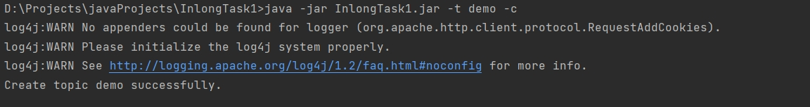

#### 2.删除主题

执行以下命令以删除主题demo：

java -jar InlongTask1.jar -t demo -d

   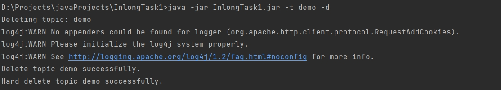

#### 3.列出所有主题

执行以下命令以列出所有主题信息(截图仅展示部分)：

java -jar InlongTask1.jar -l

   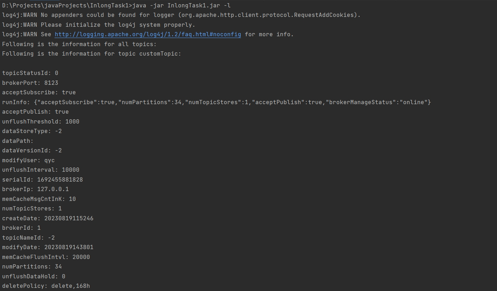

#### 4.列出某一个主题

执行以下命令以列出主题demo信息：

java -jar InlongTask1.jar -t demo -l

   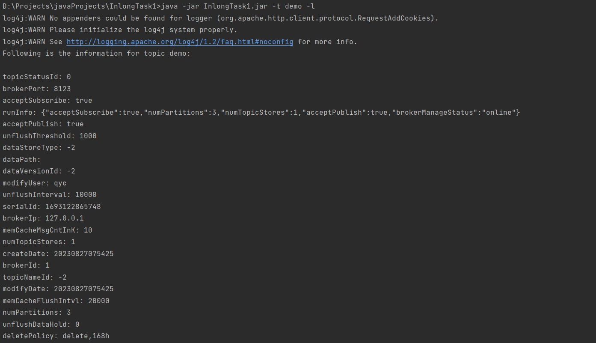

#### 5.更新主题

执行以下命令以更新主题demo信息，将acceptPublish的值置为false：

java -jar InlongTask1.jar -t demo -u -acceptPublish false

   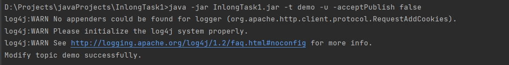

### 消息相关命令

#### 发送消息

执行以下命令以发送消息到主题demo：

java -jar InlongTask1.jar -t demo -s "async send message from single-session-factory!" -master 127.0.0.1:8715

   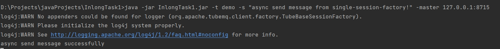

#### 消费消息

执行以下命令以从主题demo中消费消息：

java -jar InlongTask1.jar -t demo -m -master 127.0.0.1:8715 -consumergroup test

   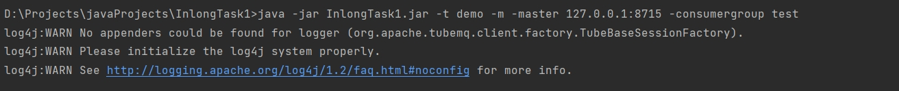

从主题demo中获得消费消息：
   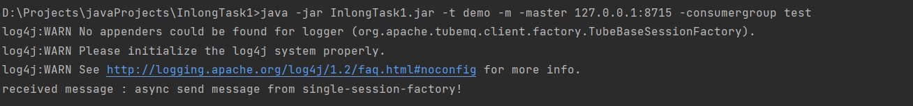
## 设计和实现

### 整体架构

TubeMQ命令行工具的架构采用命令行界面与TubeMQ客户端库相结合。工具解析命令行参数，调用TubeMQ客户端方法与TubeMQ服务进行通信。以下是工具的主要组件：

- 命令行参数解析器：使用Apache Commons CLI库解析和处理命令行参数。
- TubeMQ客户端：与TubeMQ服务进行通信，执行主题管理和消息操作。

### 主要模块和类

#### TubeMQTool.java

这是整个TubeMQ命令行工具的入口类，负责协调不同的功能模块和处理命令行参数。

设计原理:
- 解析命令行参数：使用Apache Commons CLI库解析命令行参数，识别用户输入的指令和选项。
   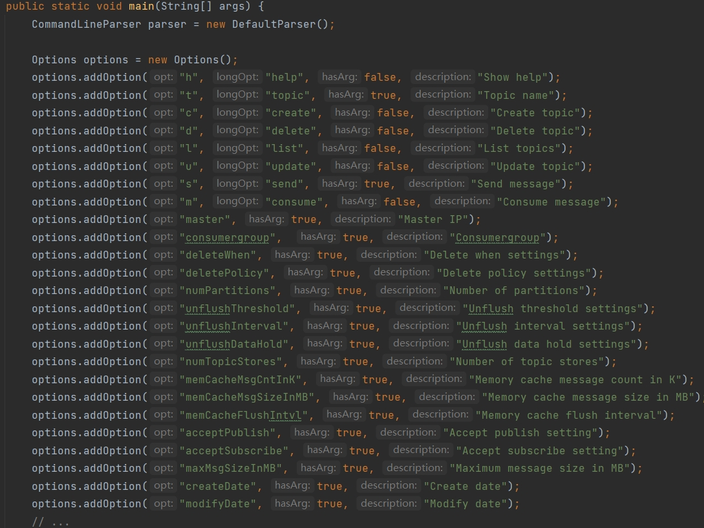
- 构建命令行选项：使用Options类创建不同的命令行选项，包括主题操作、消息发送和消费等。
   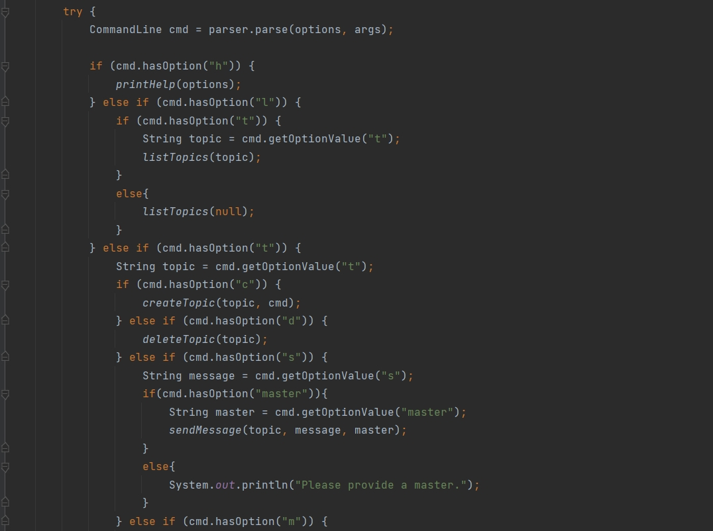
- 调用功能模块：根据用户输入的指令和选项，调用对应的功能模块来执行操作。
   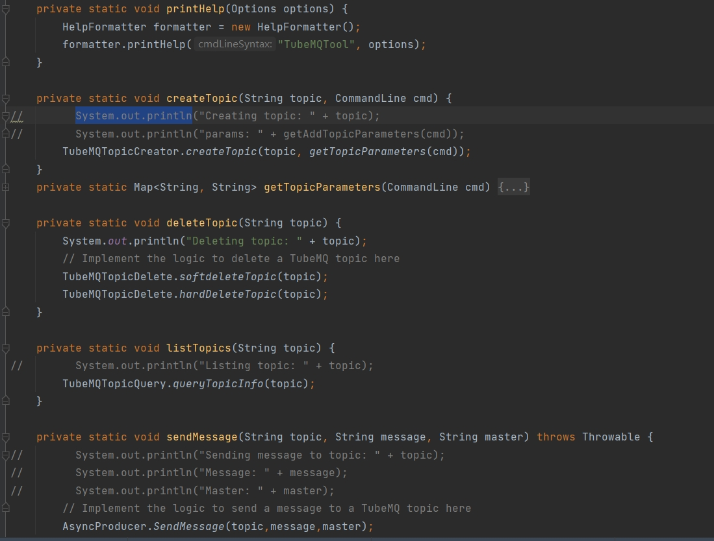
- 打印帮助信息：在用户输入错误的情况下，打印帮助信息指导用户正确使用工具。

#### TubeMQTopicCreator.java

这个类负责创建主题。根据用户输入的主题名称和相关参数，构造HTTP请求并调用TubeMQ服务接口来创建主题。

设计原理:
- 构造请求参数：根据用户输入的主题名称、非必需参数等，构造HTTP请求的参数。
   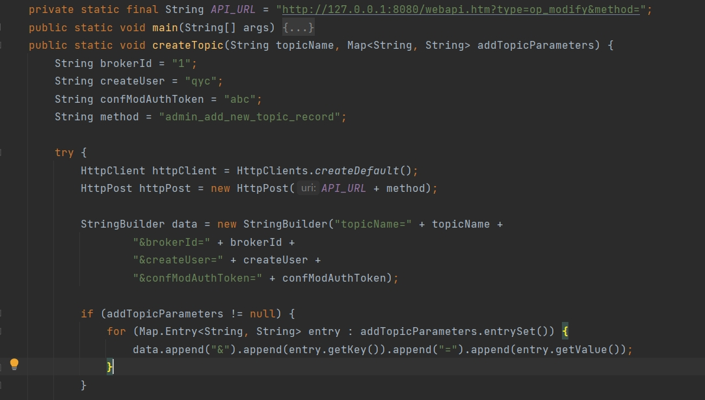
- 发送HTTP请求：使用HttpClient库创建HTTP请求，调用TubeMQ服务接口来创建主题。
   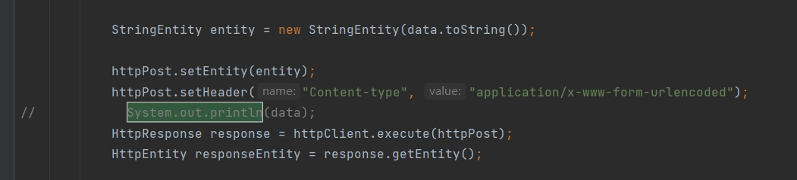
- 处理响应：解析HTTP响应，判断是否创建成功，并输出相应的提示信息。
   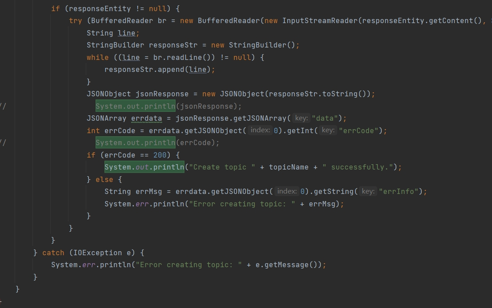
- 
#### TubeMQTopicDelete.java

这个类负责删除主题。根据用户输入的主题名称，构造HTTP请求并调用TubeMQ服务接口来删除主题。
我们先采用软删除，再进行硬删除完成主题删除

设计原理:

这里以硬删除为例：
- 构造请求参数：根据用户输入的主题名称、相关参数等，构造HTTP请求的参数。
   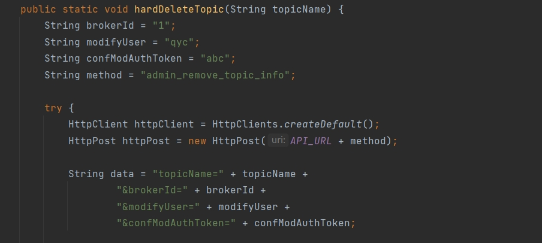
- 发送HTTP请求：使用HttpClient库创建HTTP请求，调用TubeMQ服务接口来删除主题。
   
- 处理响应：解析HTTP响应，判断是否删除成功，并输出相应的提示信息。
   

#### TubeMQTopicQuery.java

这个类负责列出所有主题的信息。调用TubeMQ服务接口来获取所有主题的信息，并输出到控制台。

设计原理:
- 调用服务接口：使用HttpClient库创建HTTP请求，调用TubeMQ服务接口来获取主题信息。
   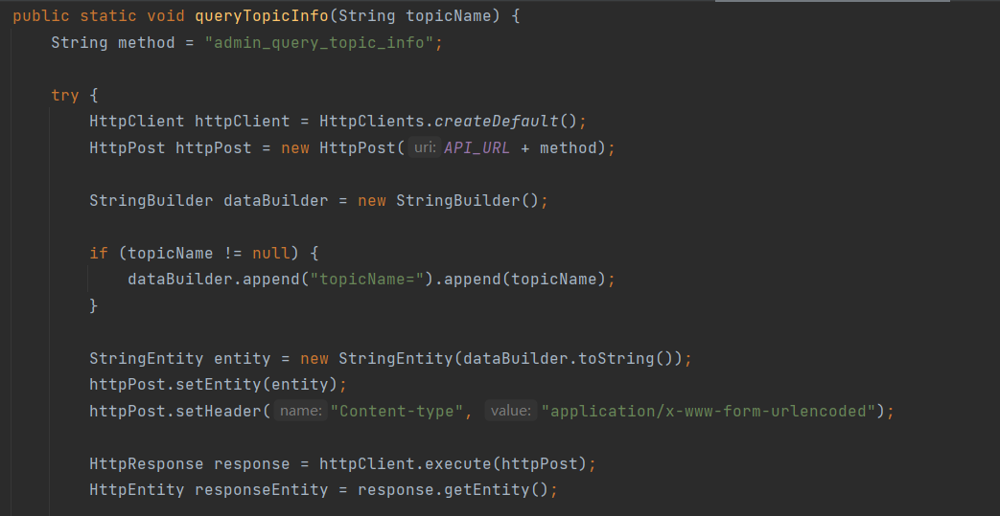
- 解析响应：解析HTTP响应，提取主题信息并进行输出。
   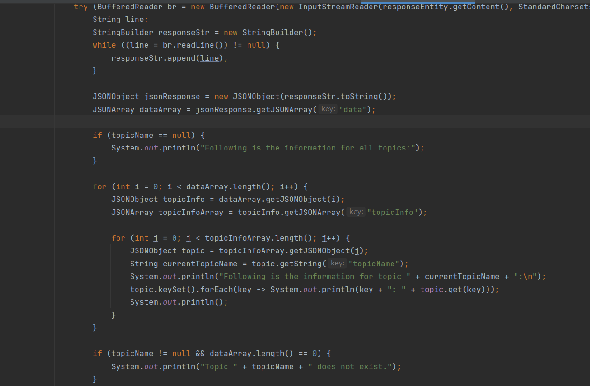

#### TubeMQTopicModify.java

这个类用于修改TubeMQ主题信息的Java类文件。该文件提供了一个命令行界面，允许用户通过命令行指令来修改指定主题的配置信息。

设计原理:
- 解析命令行参数，获取要修改的主题名称以及相关参数。
   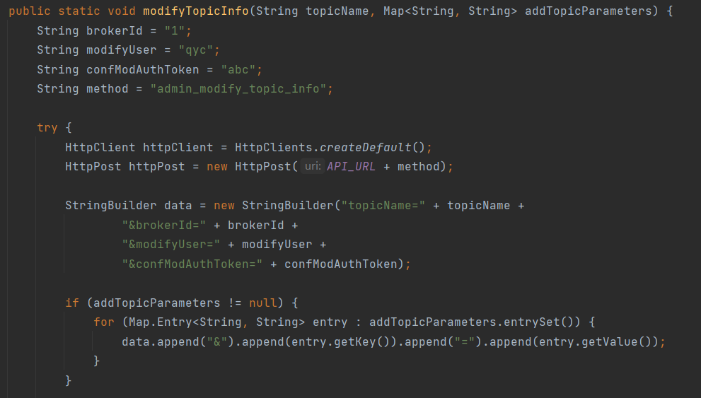
- 构造HTTP请求，将修改请求发送到TubeMQ服务器。
   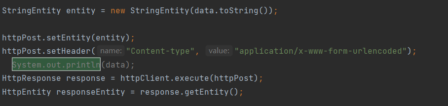
- 处理服务器返回的响应，输出成功或错误信息。
   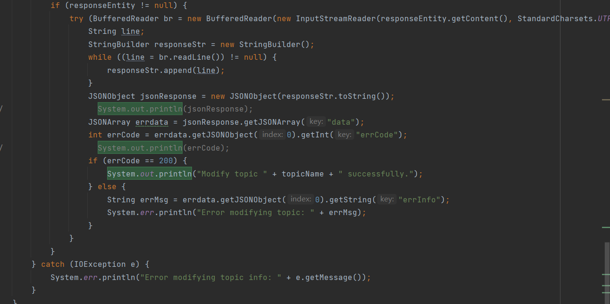

#### AsyncProducer.java

这个类负责向指定主题发送消息。根据用户输入的主题和消息内容，使用TubeMQ客户端库来发送消息。

设计原理:
- 创建客户端：使用TubeMQ客户端库创建消息生产者客户端。
- 发送消息：根据用户输入的主题和消息内容，构造消息对象并发送到指定主题。
   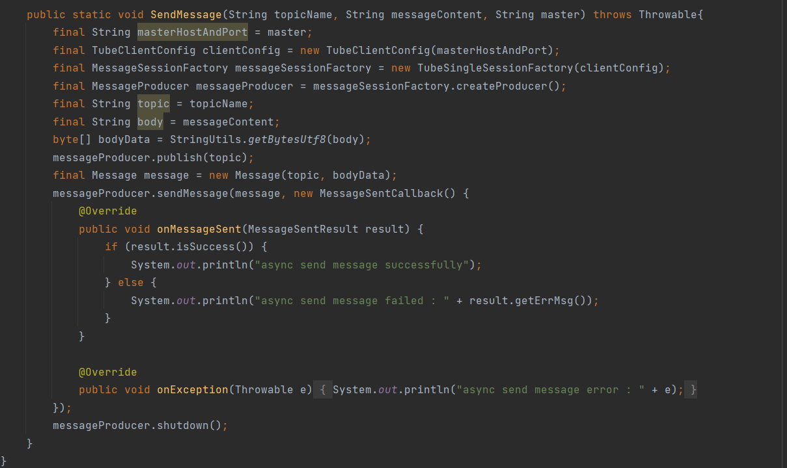

#### PushConsumer.java

这个类负责从指定主题中消费消息。根据用户输入的主题，使用TubeMQ客户端库来拉取消息并进行消费。

设计原理:
- 创建客户端：使用TubeMQ客户端库创建消息消费者客户端。
- 消费消息：从指定主题中拉取消息，对每条消息进行处理。
   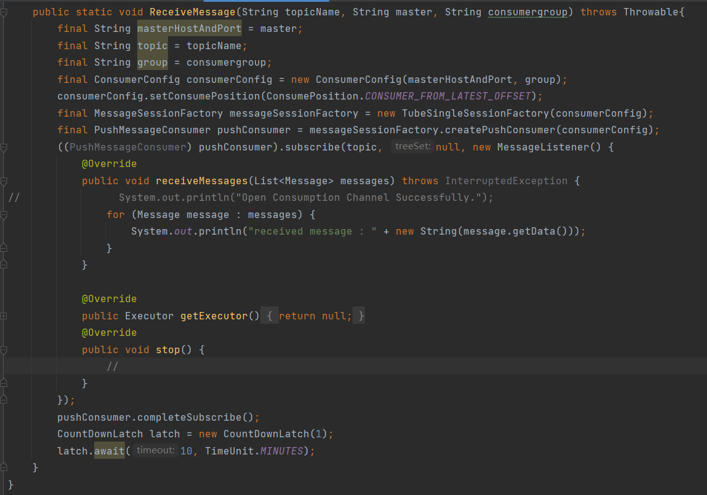

通过这些类的协作，TubeMQ命令行工具能够实现创建、删除、列出主题，以及发送和消费消息等功能。这种模块化的设计使得每个类职责明确，便于扩展和维护。

## 注意事项及常见的报错

### 1.创建报错

当执行创建主题命令时出现如下报错信息：
   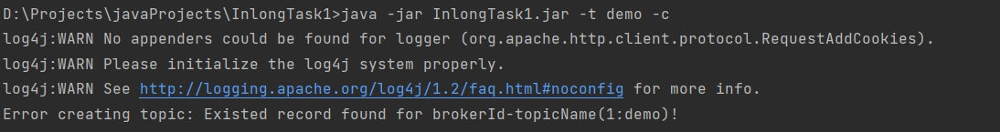

### 解决方案

报错原因是该主题已经被创建，因此修改命令创建其他主题即可

### 2.删除报错

当执行删除主题命令时出现如下报错信息：
   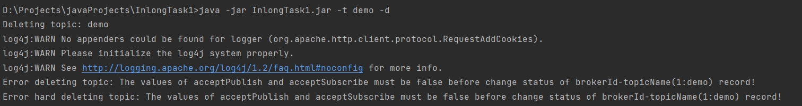

### 解决方案

报错原因是该主题的acceptPublish和acceptSubscribe未被置于false，因此执行如下命令：
   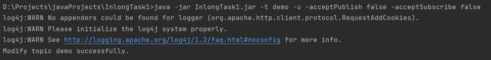

然后再执行相同命令发现问题已解决：
   

### 3.更新报错

当执行更新主题命令时出现如下报错信息：
   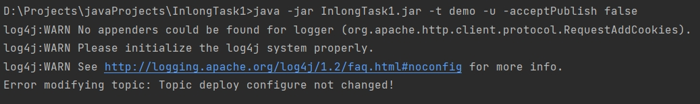

### 解决方案

报错原因是该主题的acceptPublish已经被置于false，因此修改命令更新其他项即可
